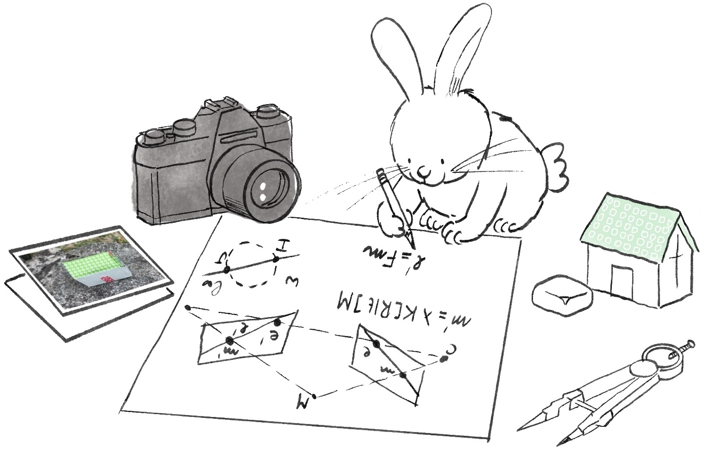

{fig-align="center" width="60%"}
A dojo is a place for practice: somewhere to return to the same ideas, repeat
simple gestures, and gradually make them your own.

This is a small and growing collection of notebooks on the geometric foundations of 3D computer vision: projective planes, homographies, rectification, robust fitting, and, in time, more.

LLMs can now produce a surprising amount of working code in very little time, and much of it is correct. They will explain it as well, and clearly. But an explanation received is not the same as an argument understood.

The notebooks here therefore take a deliberately slower path. They are meant to
be studied much like a mathematics book: with patience, perhaps with paper and
pencil nearby, following each construction one step at a time. Every algorithm
is developed through code that can be run, changed, broken, and put back
together.

Some parts of the collection are already usable; others are still sketches,
experiments, or plans. This page is therefore both a course resource and a
public notebook in progress. Over time, it may grow into a more complete set of
notes on geometric computer vision.

To whoever has the patience to work through these pages: I hope you find results that are correct and useful, and that you will tell me when they are not. Above all I hope you find the pleasure of having understood something yourself, and some affection for the elegance of geometry underneath it all.


## The notebooks

|     |                          |                                                                     |
|-----|--------------------------|---------------------------------------------------------------------|
| 01  | The projective plane     | points, lines, duality, conics                                       |
| 02  | Homographies             | DLT from points and lines, warping                                   |
| 03  | Rectification            | [affine](notebooks/rectification/affine.ipynb), metric, stratified, direct |
| 04  | Measuring from one view  | vanishing points, horizon, affine measurements                       |
| 05  | Robust fitting           | RANSAC, LMedS, MSAC, Hough                                           |
| 06  | Putting it together      | feature matching, stitching                                          |

: {tbl-colwidths="[8,32,60]"}

Sections without a link are still in preparation.

## How to use this collection

Each notebook is designed to run from top to bottom. You can open it in Colab
and work through the cells in order. 

Read the explanations, inspect the intermediate quantities, and modify the
examples. Keep paper nearby when a derivation becomes difficult. A notebook
often becomes most useful when something is changed and the result is not quite
what was expected.

To run the notebooks locally:

``` bash
git clone https://github.com/magrilu/cv-dojo.git
cd cv-dojo
pip install -r requirements.txt
```

Students following one of my courses can find a suggested reading order under
**Courses** in the menu above.

The original MATLAB scripts used in the Politecnico exercise sessions are kept
under [`matlab/`](https://github.com/magrilu/cv-dojo/tree/main/matlab).


## Acknowledgements


My first thanks go to my father, Maurizio Magri, who taught me the joy and
satisfaction of approaching mathematics armed with patience, paper, and pencil.
I had to add an eraser, as my mistakes were rather more frequent than his.

I hope these notebooks owe something to the way Andrea Fusiello taught me to
approach computer vision. Whatever elegance they may contain is certainly
inherited from his
[Computer Vision Toolkit](https://github.com/fusiello/Computer_Vision_Toolkit),
to which every interested reader is warmly—and immediately—referred. Any errors,
of course, are entirely my own.

I am also grateful to Giacomo Boracchi, with whom I have taught these topics on
several occasions. His genuine commitment to teaching has been a
source of inspiration. I share his conviction that teaching a student to reason clearly and
independently is one of the most lasting ways in which we can contribute to the
world.

These notebooks began as material for the exercise sessions in Vincenzo Caglioti’s
course at Politecnico di Milano. I am grateful to him for the opportunity to develop and teach many of these ideas in that setting.


## About this project

These notebooks grew out of material prepared for Computer Vision courses and exercise sessions. They are still growing: I revise them as I teach with
them, correct mistakes, add examples, and find better ways of explaining things.

If you find a mistake, something unclear, or simply want to discuss one of the
notebooks, please write to me. Corrections and suggestions are always welcome.

## Using this material

Please use the code and build on it. It is released under the MIT License.

The text and illustrations are licensed under CC BY-NC-ND 4.0: you are welcome
to share them unchanged for non-commercial purposes, with appropriate credit.
If you would like to translate, adapt, or reuse them in some other way, just
write to me. You can have a look at the [licensing
page](https://github.com/magrilu/cv-dojo/blob/main/LICENSE.md).


If you find this material useful and would like to cite it, here is a BibTeX entry:

``` bibtex
@software{magri_cvdojo,
  author = {Magri, Luca},
  title  = {Computer Vision Dojo},
  year   = {2026},
  url    = {https://github.com/magrilu/cv-dojo}
}
```
